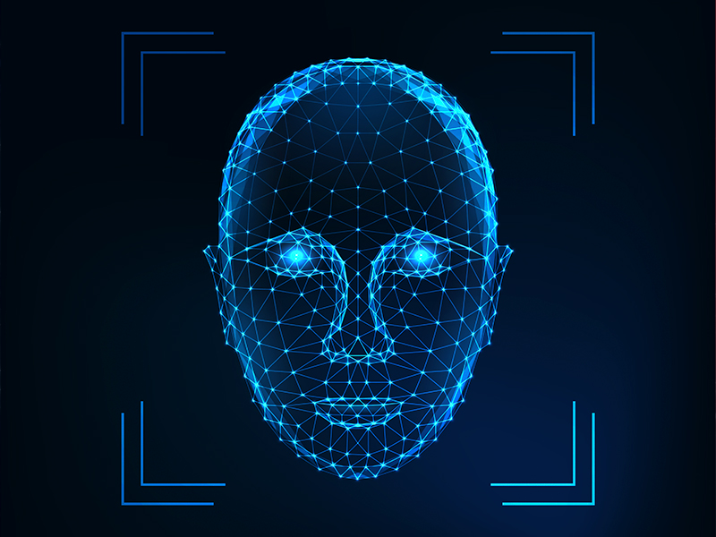

# Facial Recognition Application



This project is a Windows Forms application for facial recognition. It utilizes **Emgu CV**, a .NET wrapper for OpenCV, to capture, detect, and recognize faces using the EigenFaceRecognizer. The app enables face detection, training, and recognition from live webcam input.

---

## Features

1. **Face Detection**: Detect faces in real-time using a pre-trained Haar cascade classifier.
2. **Face Recognition**: Recognize known individuals using EigenFaceRecognizer.
3. **Image Capture**: Save detected faces for training purposes.
4. **Training**: Train the model with saved face images.
5. **User Interface**: Intuitive UI with buttons for each feature.

---

## High-Level Architecture

### Program Entry Point

The application starts with the `Main` method in `Program.cs`, which initializes the `Form1` UI.

```csharp
[STAThread]
static void Main()
{
    Application.EnableVisualStyles();
    Application.SetCompatibleTextRenderingDefault(false);
    Application.Run(new Form1());
}
```

### Form1 Core Components

- **Variables**: Handles webcam capture, frame processing, face detection, and training data.
- **UI Elements**: Buttons (`btnCapture`, `btnAdd`, `btnTrain`, etc.), picture boxes (`picCapture`, `picDetected`), and text input for person names.

---

## Code Walkthrough

### Face Detection

Real-time face detection uses a Haar cascade. Detected faces are displayed in a picture box.

```csharp
private void ProcessFrame(object sender, EventArgs e)
{
    videoCapture.Retrieve(frame, 0);
    currentFrame = frame.ToImage<Bgr, Byte>().Resize(picCapture.Width, picCapture.Height, Inter.Cubic);

    if (facesDetectionEnabled)
    {
        Mat grayImage = new Mat();
        CvInvoke.CvtColor(currentFrame, grayImage, ColorConversion.Bgr2Gray);
        Rectangle[] faces = faceCasacdeClassifier.DetectMultiScale(grayImage, 1.1, 3, Size.Empty, Size.Empty);

        foreach (var face in faces)
        {
            Image<Bgr, Byte> resultImage = currentFrame.Convert<Bgr, Byte>();
            resultImage.ROI = face;
            picDetected.Image = resultImage.Bitmap;
        }
    }
    picCapture.Image = currentFrame.Bitmap;
}
```

### Training

Training the model involves reading saved images and creating a dataset for EigenFaceRecognizer.

```csharp
private bool TrainImagesFromDir()
{
    string path = Directory.GetCurrentDirectory() + @"\TrainedImages";
    string[] files = Directory.GetFiles(path, "*.jpg", SearchOption.AllDirectories);

    foreach (var file in files)
    {
        Image<Gray, byte> trainedImage = new Image<Gray, byte>(file).Resize(200, 200, Inter.Cubic);
        TrainedFaces.Add(trainedImage);
        PersonsLabes.Add(ImagesCount++);
        string name = file.Split('\\').Last().Split('_')[0];
        PersonsNames.Add(name);
    }

    if (TrainedFaces.Count > 0)
    {
        recognizer = new EigenFaceRecognizer(TrainedFaces.Count, 2000);
        recognizer.Train(TrainedFaces.ToArray(), PersonsLabes.ToArray());
        isTrained = true;
    }
    return isTrained;
}
```

### Face Recognition

Recognized faces are compared to the trained model, with the results displayed on the UI.

```csharp
if (isTrained)
{
    Image<Gray, Byte> grayFaceResult = resultImage.Convert<Gray, Byte>().Resize(200, 200, Inter.Cubic);
    var result = recognizer.Predict(grayFaceResult);

    if (result.Label != -1 && result.Distance < 2000)
    {
        CvInvoke.PutText(currentFrame, PersonsNames[result.Label], new Point(face.X - 2, face.Y - 2),
            FontFace.HersheyComplex, 1.0, new Bgr(Color.Orange).MCvScalar);
    }
    else
    {
        CvInvoke.PutText(currentFrame, "Unknown", new Point(face.X - 2, face.Y - 2),
            FontFace.HersheyComplex, 1.0, new Bgr(Color.Red).MCvScalar);
    }
}
```

---

## How to Use

1. **Setup**:
   - Install [Emgu CV](https://www.emgu.com/) and ensure its dependencies are available.
   - Place the `haarcascade_frontalface_alt.xml` file in the correct path.

2. **Running**:
   - Compile and run the application.
   - Use the UI to capture and process frames from your webcam.

3. **Features**:
   - **Capture**: Start the webcam feed.
   - **Add**: Save detected faces for training.
   - **Train**: Train the recognizer with saved images.
   - **Recognize**: Identify faces in real-time.

---

## Directory Structure

```
FacialRecognition/
├── TrainedImages/  # Saved face images for training
├── haarcascade_frontalface_alt.xml   # Haar cascade XML
├── Program.cs
├── Form1.cs
└── Form1.Designer.cs
```

---

## Dependencies

- **.NET Framework 4.7.2 or higher**
- **Emgu CV 4.x**
- **Haar Cascade Classifier**

---

## Future Improvements

- Add support for multiple face detection simultaneously.
- Improve recognition accuracy with alternative models.
- Implement database integration for managing face data.

---

Feel free to contribute or report issues on this repository! 😊
